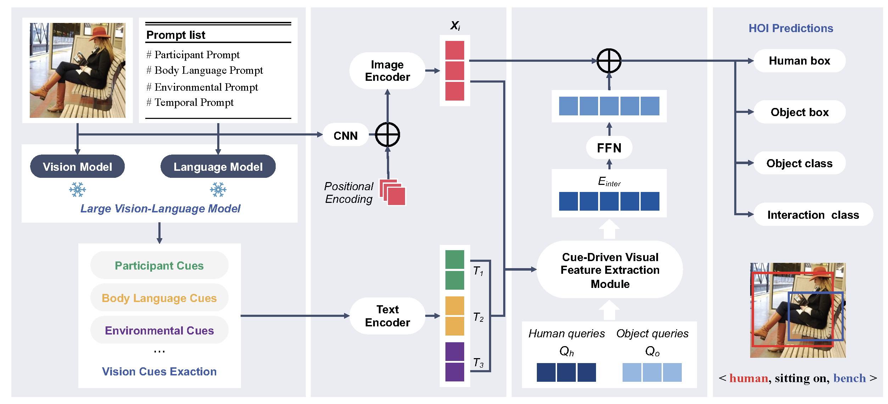

# Enhancing HOI Detection with Contextual Cues from Large Vision-Language Models

Code for our paper "Enhancing HOI Detection with Contextual Cues from Large Vision-Language Models".
Example Code Integration with HOICLIP Method.



## Installation

Install the dependencies.

```
pip install -r requirements.txt
```

## Data preparation

### HICO-DET

HICO-DET dataset can be downloaded [here](https://drive.google.com/open?id=1QZcJmGVlF9f4h-XLWe9Gkmnmj2z1gSnk). After
finishing downloading, unpack the tarball (`hico_20160224_det.tar.gz`) to the `data` directory.

Instead of using the original annotations files, we use the annotation files provided by the PPDM authors. The
annotation files can be downloaded from [here](https://drive.google.com/open?id=1WI-gsNLS-t0Kh8TVki1wXqc3y2Ow1f2R). The
downloaded annotation files have to be placed as follows. After
decompress, the files should be placed under `data/hico_20160224_det/annotations`.

```
data
 └─ hico_20160224_det
     |─ annotations
     |   |─ trainval_hico.json
     |   |─ test_hico.json
     |   └─ corre_hico.json
     :
```

### V-COCO

First clone the repository of V-COCO from [here](https://github.com/s-gupta/v-coco), and then follow the instruction to
generate the file `instances_vcoco_all_2014.json`. Next, download the prior file `prior.pickle`
from [here](https://drive.google.com/drive/folders/10uuzvMUCVVv95-xAZg5KS94QXm7QXZW4). Place the files and make
directories as follows.

```
ConCue
 |─ data
 │   └─ v-coco
 |       |─ data
 |       |   |─ instances_vcoco_all_2014.json
 |       |   :
 |       |─ prior.pickle
 |       |─ images
 |       |   |─ train2014
 |       |   |   |─ COCO_train2014_000000000009.jpg
 |       |   |   :
 |       |   └─ val2014
 |       |       |─ COCO_val2014_000000000042.jpg
 |       |       :
 |       |─ annotations
 :       :
```

For our implementation, the annotation file have to be converted to the HOIA format. The conversion can be conducted as
follows.

```
PYTHONPATH=data/v-coco \
        python convert_vcoco_annotations.py \
        --load_path data/v-coco/data \
        --prior_path data/v-coco/prior.pickle \
        --save_path data/v-coco/annotations
```

Note that only Python2 can be used for this conversion because `vsrl_utils.py` in the v-coco repository shows a error
with Python3.

V-COCO annotations with the HOIA format, `corre_vcoco.npy`, `test_vcoco.json`, and `trainval_vcoco.json` will be
generated to `annotations` directory.

## Pre-trained model

Download the pretrained model of DETR detector for [ResNet50](https://dl.fbaipublicfiles.com/detr/detr-r50-e632da11.pth)
, and put it to the `params` directory.

```
python ./tools/convert_parameters.py \
        --load_path params/detr-r50-e632da11.pth \
        --save_path params/hico_50_4_noattention.pth \
        --num_queries 64

python ./tools/convert_parameters.py \
        --load_path params/detr-r50-e632da11.pth \
        --save_path params/vcoco_50_4_noattention.pth \
        --dataset vcoco \
        --num_queries 64
```
Download the pretrained model of RoBERTa base [model](https://huggingface.co/roberta-base)
, and put it to the `params` directory. Place the files and make
directories as follows.

```
ConCue
 |─ params
 │   |─ hico_50.pth
 |   |─ vcoco_50.pth
 |   └─ roberta-base
 |       |─ config.json
 |       |─ dict.txt
 |       |─ flax_model.msgpack
 |       |─ gitattributes.txt
 :       :
```

## Training

After the preparation, you can start training with the following commands.

### HICO-DET

```
# default setting
sh ./scripts/train_hico.sh
```

### V-COCO

```
sh ./scripts/train_vcoco.sh
```

### Zero-shot

```
# rare first unseen combination setting
sh ./scripts/train_hico_rf_uc.sh
# non rare first unseen combination setting
sh ./scripts/train_hico_nrf_uc.sh
# unseen object setting
sh ./scripts/train_hico_uo.sh
# unseen verb setting
sh ./scripts/train_hico_uv.sh
```

### Generate visual cues for HICO-DET

```
sh ./scripts/gen_cues.sh
```
If you want to generate visual cues from multiple perspectives, change the `--visual_cues`.

## Evaluation

### HICO-DET

You can conduct the evaluation with trained parameters for HICO-DET as follows.

``` 
python3 -m torch.distributed.launch \
        --nproc_per_node=1 \
        --use_env \
        main.py \
        --output_dir output/default \
        --dataset_file hico \
        --hoi_path ./data/hico_20160224_det/ \
        --num_obj_classes 80 \
        --num_verb_classes 117 \
        --backbone resnet50 \
        --num_queries 64 \
        --dec_layers 3 \
        --epochs 90 \
        --lr_drop 60 \
        --use_nms_filter \
        --fix_clip \
        --batch_size 16 \
        --pretrained ./params/hico_50_4_noattention.pth \
        --with_clip_label \
        --gradient_accumulation_steps 1 \
        --num_workers 8 \
        --opt_sched "multiStep" \
        --dataset_root GEN \
        --model_name HOICLIP \
        --zero_shot_type default \
        --resume [path to your checkpoint] \
        --verb_pth ./tmp/verb.pth \
        --training_free_enhancement_path \
        ./training_free_ehnahcement/
```

For the official evaluation (reported in paper), you need to covert the prediction file to an official prediction format
following [this file](./tools/covert_annot_for_official_eval.py), and then
follow [PPDM](https://github.com/YueLiao/PPDM) evaluation steps.

### Zero-shot
Taking RF-UC as an example, you can conduct the evaluation with trained parameters for HICO-DET as follows.

```
python3 -m torch.distributed.launch \
        --nproc_per_node=1 \
        --use_env \
        main.py \
        --output_dir output/rf_uc \
        --dataset_file hico \
        --hoi_path ./data/hico_20160224_det/ \
        --num_obj_classes 80 \
        --num_verb_classes 117 \
        --backbone resnet50 \
        --num_queries 64 \
        --dec_layers 3 \
        --epochs 90 \
        --lr_drop 60 \
        --use_nms_filter \
        --fix_clip \
        --batch_size 16 \
        --pretrained ./params/hico_50_4_noattention.pth \
        --with_clip_label \
        --gradient_accumulation_steps 1 \
        --num_workers 8 \
        --opt_sched "multiStep" \
        --dataset_root GEN \
        --model_name HOICLIP \
        --del_unseen \
        --zero_shot_type rare_first \
        --resume [path to your checkpoint] \
        --verb_pth ./tmp/verb.pth \
        --training_free_enhancement_path \
        ./training_free_ehnahcement/
```
## Regular HOI Detection Results

### HICO-DET

|                | Full | Rare | Non-rare |                                             Model                                             |
|:---------------|:----:|:----:|:--------:|:---------------------------------------------------------------------------------------------:|
| HOICLIP+ConCue | 37.46 | 36.75 |  37.68   | [model](https://drive.google.com/file/d/1Nd8fiUH07zTniiQs2Rh0a05A3wawmvmL/view?usp=drive_link)|

## Zero-shot HOI Detection Results

|      |Type | Unseen | Seen  | Full  |                                             Model                                              |
|:-----| :---: |:------:|:-----:|:-----:|:----------------------------------------------------------------------------------------------:|
| HOICLIP+ConCue |RF-UC | 31.51  | 36.99 | 35.51 |  [model](https://drive.google.com/file/d/1aV4c5AqqXCbxcCq5Zeqk2n6-gN0D9pSa/view?usp=drive_link)   |
| HOICLIP+ConCue |NF-UC | 30.54  | 32.45 | 32.07 | [model](https://drive.google.com/file/d/1l2nBPUU4FWclz6Jt_Hx8Q1ixdy7-jlUY/view?usp=drive_link) |
| HOICLIP+ConCue |UO | 18.64  | 33.78 | 31.18 | [model](https://drive.google.com/file/d/1lgfIyl8mSrQ_RtxPeDohjlv8qsl5xn96/view?usp=drive_link) |
| HOICLIP+ConCue |UV| 26.97  | 35.77 | 34.53 | [model](https://drive.google.com/file/d/1xkWXPg-FXam62U6_JsQEkJ81pu203k7F/view?usp=drive_link) |

## Acknowledge

Codes are built from [HOICLIP](https://github.com/Artanic30/HOICLIP), [GEN-VLKT](https://github.com/YueLiao/gen-vlkt), [PPDM](https://github.com/YueLiao/PPDM)
, [DETR](https://github.com/facebookresearch/detr), and [QPIC](https://github.com/hitachi-rd-cv/qpic). We thank them for their contributions.
